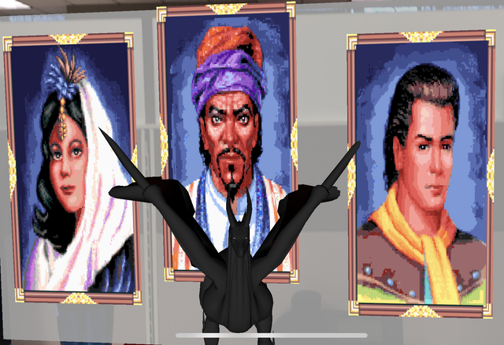
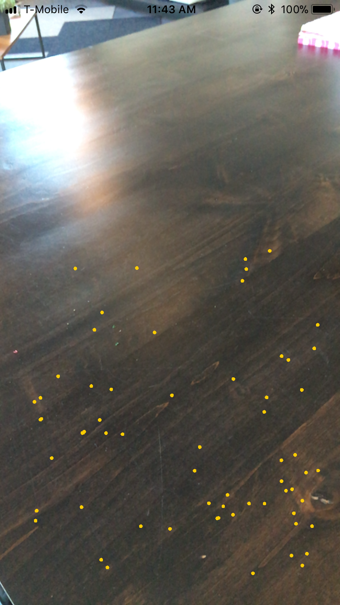
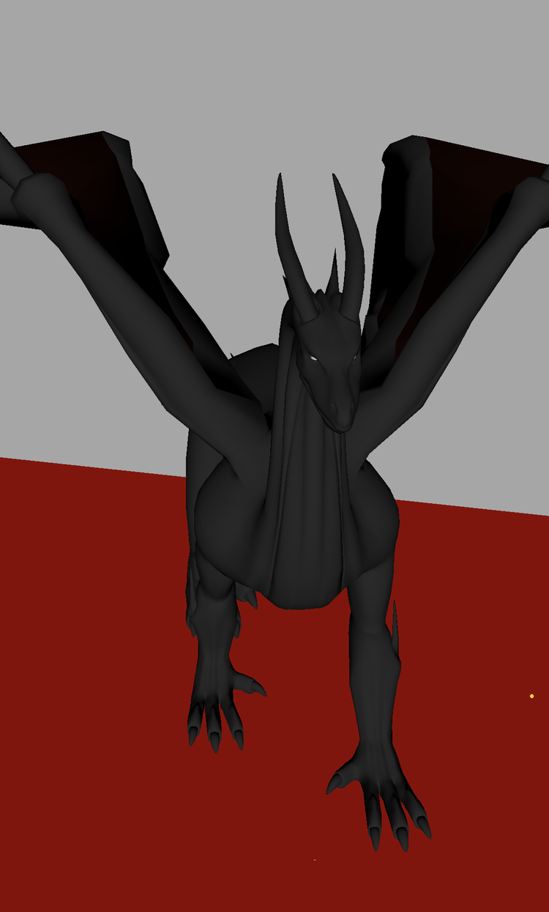
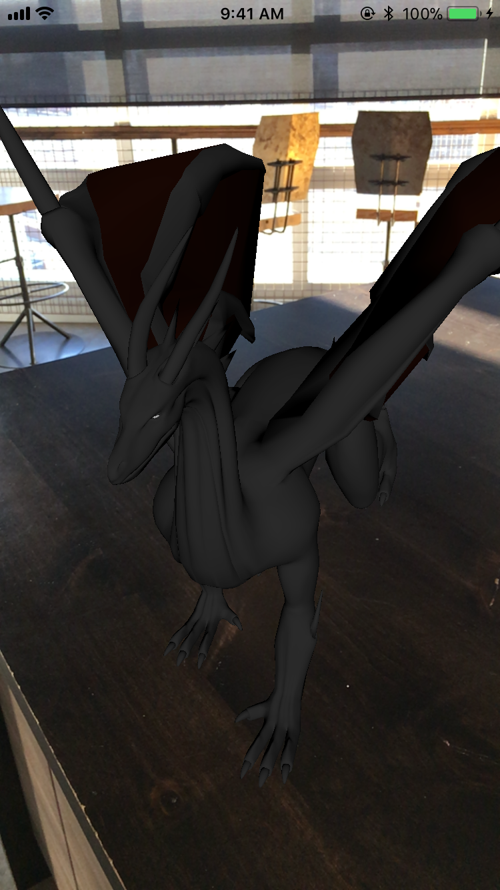
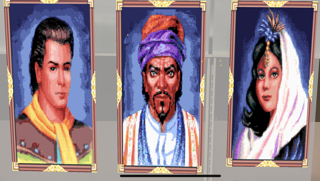

# ARDemo
_Working With ARKit_



Augmented Reality (AR) has been around for a number of years, but it has only been in the past year that AR has finally been making some inroads into the mainstream, starting with the mobile game Pokémon GO.

Now Apple is opening up the capabilities of AR to developers and millions of AR-ready iOS devices with the introduction of the new ARKit framework.  Developers have quickly embraced the new capabilities provided by ARKit by developing useful utilities to games enhanced by the AR experience.  

There are numerous articles currently available about how to initially set up an ARKit project, so this post will focus more on specific topics when developing with ARKit and SceneKit.

This article makes use of a [sample AR demo project](https://github.com/edenwaith/ARDemo) which detects horizontal and vertical planes, and when these planes are tapped, a 3D model of a dragon or 2D portraits are placed into the scene.  Tapping on the dragon will also toggle the model's animation.


## Plane Detection ##

One of the key aspects to AR is for the device to be able to inspect its environment so it can learn how to interact with its surroundings, especially when trying to place virtual objects on a surface.  Since ARKit does not come with a [Hervé Villechaize](http://www.imdb.com/name/nm0898199/?ref_=fn_al_nm_1) module, your AR app will need to implement the `ARSCNViewDelegate` to help find "da plane".

Plane detection is initially disabled, so it needs to be set, otherwise the device will not look for available surfaces.  To enable plane detection, ensure that the `ARWorldTrackingConfiguration` object's `planeDetection` property has been set to `.horizontal`, `.vertical`, or both.  

```swift
// Create a session configuration
let configuration = ARWorldTrackingConfiguration()
configuration.planeDetection = [.horizontal, .vertical]
configuration.isLightEstimationEnabled = true

// Run the view's session
sceneView.session.run(configuration)
```

ARKit initially only supported the detection of horizontal planes, but with the release of ARKit 1.5, vertical planes are also detected.  

Plane detection is far from a precise science at this point, and it usually takes at least several seconds to detect a suitable plane.  You might need to move your iOS device around so it gains knowledge of its environment so it can better estimate the distance to surrounding objects.

To aid in detecting a plane, set the  `sceneView.debugOptions = [ ARSCNDebugOptions.showFeaturePoints ]` to provide the yellow dots, which indicates that the camera is trying to detect reference points in the environment.  Objects which are shiny or lack any proper definition make it difficult for the device to obtain a decent reference point and to be able to distinguish unique points in the environment.  Areas with poor lighting conditions can also compound these problems.  If you are not seeing many yellow feature points, slowly move around the area and point the device's camera at different objects to help determine which surfaces can be identified.  



Once a plane has been detected, the `ARSCNViewDelegate` method `renderer(_:didAdd:for:)` is called to add the new `ARAnchor` to the scene.  In this example, horizontal planes are colored red and vertical planes are a semi-opaque grey to make it easier to identify the planes which have been recognized by the app.

```swift
func renderer(_ renderer: SCNSceneRenderer, didAdd node: SCNNode, for anchor: ARAnchor) {

    guard let planeAnchor = anchor as? ARPlaneAnchor else { return }
    
    let width  = CGFloat(planeAnchor.extent.x)
    let height = CGFloat(planeAnchor.extent.z)
    let plane  = SCNPlane(width: width, height: height)
    
    // Set the color of the plane
    if planeAnchor.alignment == .horizontal {
        plane.materials.first?.diffuse.contents = UIColor.red
    } else if planeAnchor.alignment == .vertical {
        plane.materials.first?.diffuse.contents = UIColor(red: 0.8, green: 0.8, blue: 0.8, alpha: 0.7)
    }
    
    let planeNode = SCNNode(geometry: plane)
    let x = CGFloat(planeAnchor.center.x)
    let y = CGFloat(planeAnchor.center.y)
    let z = CGFloat(planeAnchor.center.z)
    
    planeNode.position = SCNVector3(x, y, z)
    planeNode.eulerAngles.x = -.pi / 2
    
    node.addChildNode(planeNode)
}
```

After the initial plane is added, ARKit continues to inspect the environment and will build upon the existing known planes and join them into larger planes, which is the purpose of the following method.

```swift
func renderer(_ renderer: SCNSceneRenderer, didUpdate node: SCNNode, for anchor: ARAnchor) {
    
    guard let planeAnchor = anchor as?  ARPlaneAnchor,
        let planeNode = node.childNodes.first,
        let plane = planeNode.geometry as? SCNPlane
        else { return }
    
    let width    = CGFloat(planeAnchor.extent.x)
    let height   = CGFloat(planeAnchor.extent.z)
    plane.width  = width
    plane.height = height
    
    let x = CGFloat(planeAnchor.center.x)
    let y = CGFloat(planeAnchor.center.y)
    let z = CGFloat(planeAnchor.center.z)
    
    planeNode.position = SCNVector3(x, y, z)
}
```



## 3D Models in SceneKit ##

ARKit integrates well with SpriteKit and SceneKit, Apple's respective 2D and 3D frameworks, which have been available for macOS and iOS for a number of years.  Due to these years of development, Apple already has mature platforms which can be quickly hooked into an AR project to add 2D or 3D virtual elements. 

There's a wide variety of 3D model formats available, but this project works with [COLLADA](https://en.wikipedia.org/wiki/COLLADA) (.dae) files.  COLLADA is an open 3D format which many 3D modeling apps support.  It was originally intended as an interchange format between competing 3D standards, but it has gained the support of a number of software tools, game engines and applications.  COLLADA is also well supported in the Apple ecosystem, including the macOS Finder, Preview, and Xcode.

If your model has image textures which are referenced in the model file, then copy the `.dae` file and its associated image assets into the `art.scnassets` folder.  One of the advantages of COLLADA being an open XML format is that the model file can be opened and edited with a standard text editor, which can be particularly useful if the image paths were improperly referenced (absolute path versus a relative path).

```swift
let dragonScene = SCNScene(named: "art.scnassets/Dragon_Baked_Actions_fbx_6.dae")!
let position = anchor.transform

// Iterate through all of the nodes and add them to the dragonNode object
for childNode in dragonScene.rootNode.childNodes {
    self.dragonNode.addChildNode(childNode)
}

// Scale and position the node
let scale:Float = 0.01
self.dragonNode.scale = SCNVector3(x: scale, y: scale, z: scale)
self.dragonNode.position = SCNVector3(x: position.columns.3.x, y: position.columns.3.y, z: position.columns.3.z)

// Add the dragonNode to the scene
sceneView.scene.rootNode.addChildNode(self.dragonNode)
self.dragonNode.isPaused = true // Initially pause any animations
```


 

## Adding 2D Images in a 3D Scene ##



In addition to adding the dragon to the scene, this demo can add up to ten different portraits on a tapped vertical plane (e.g. a wall or some other vertical service).

Adding a 2D image to a 3D scene bears some of the similar complexities to adding a 3D model.  With a standard iOS or Mac application, adding an image to a view is fairly simple, but in this case, it requires several steps to add a 2D image to the scene.  

1. Create an `SCNMaterial` object and then assign a `UIImage` to its `diffuse.contents` property.  
2. Add the `SCNMaterial` to an `SCNPlane` object with the dimensions of 0.25 meters by 0.5 meters.  
3. Add the `SCNPlane` object to an `SCNNode`, which can then be positioned and rotated in the 3D scene.  
4. Add the `SCNNode` object as a child node to the scene's `rootNode`.

```swift
// 1 - Create material
let imageMaterial = SCNMaterial()
imageMaterial.diffuse.contents = UIImage(named: self.portraitNames[portraitsPlaced])

// 2 - Create plane
let portraitPlane = SCNPlane(width: 0.25, height: 0.5)
portraitPlane.materials = [imageMaterial]

// 3 - Create node
let portraitNode = SCNNode(geometry: portraitPlane)
portraitNode.position = SCNVector3(x: hitResult.worldTransform.columns.3.x, y: hitResult.worldTransform.columns.3.y, z: hitResult.worldTransform.columns.3.z+0.03)
// Perform any extra transforms here

// 4 - Add node to scene
self.sceneView.scene.rootNode.addChildNode(portraitNode)
``` 

As can be seen by the amount of code, this is far more involved than simply setting the `image` property on a `UIImageView` to add an image to an AR scene.

## Clearing Out Old Scenes ##
Loading in 3D models and their associated textures can be extremely memory intensive, so it is essential that any unused resources are properly released.

When removing a child node from a scene, it is not good enough to just call the node's `removeFromParentNode()` method.  Any material objects from the node's geometry also need to be set to `nil` before removing the node from it's parent.

```swift
func clearScene() {

    sceneView.session.pause()
    sceneView.scene.rootNode.enumerateChildNodes { (node, stop) in
        // Free up memory when removing the node by removing any textures
        node.geometry?.firstMaterial?.normal.contents = nil
        node.geometry?.firstMaterial?.diffuse.contents = nil
        node.removeFromParentNode()
    }
}
```

## Hit Detection ##

Being able to add objects to a scene is a key element for creating an augmented experience, but it does not provide much usefulness if one cannot interact with the environment.  For this demonstration, tapping on the dragon will toggle its animation.

Upon tapping the screen, the `sceneView` will perform a hit test by extending a ray from where the screen was touched and will return an array of all of the objects which intersected the ray.  The first object in the array is selected, which represents the object closest to the camera.

Since a 3D object might be comprised of multiple smaller nodes, the selected node might be a child node of a larger object.  To check if the dragon model was tapped, the selected node's parent node is compared against the dragon node.  If so, this will then call a method to toggle the model's animation.

```swift
func registerTapRecognizer() {
    let tapGestureRecognizer =  UITapGestureRecognizer (target:self ,action : #selector (screenTapped))
    self.sceneView.addGestureRecognizer(tapGestureRecognizer)
}

@objc func screenTapped(tapRecognizer: UITapGestureRecognizer) {
	
    let tappedLocation = tapRecognizer.location(in: self.sceneView)
    let hitResults = self.sceneView.hitTest(tappedLocation, options: [:])
    
    // 1: Check if the dragon node was tapped
    if hitResults.count > 0 {
        guard let firstHitResult = hitResults.first else {
            return
        }
        
        if self.dragonNode == firstHitResult.node.parent {
            self.toggleDragonAnimation()
            return
        }
    }
```

If the dragon is not tapped, then the `screenTapped` method checks if a plane was tapped instead.  If it was a horizontal plane, then the dragon is placed on that plane if it has not been not already been added to the scene.  If a vertical plane was tapped, then a portrait is hung on the "wall".  In this demo, up to ten different portraits can be placed on vertical surfaces.

```swift    
    // 2: Add objects to the scene
    let hitTestResults = sceneView.hitTest(tapLocation, types: .existingPlaneUsingExtent)

    guard let hitTestResult = hitTestResults.first,
          let anchor = hitTestResult.anchor as? ARPlaneAnchor else { return }
    
    if anchor.alignment == .vertical { // Add portraits
    
        self.loadPortrait(with: anchor, hitResult: hitTestResult)
    
    } else if anchor.alignment == .horizontal { // Add dragon
        
        let childNodes = sceneView.scene.rootNode.childNodes
        // Try adding a dragon to the scene if it doesn't exist
        if childNodes.contains(self.dragonNode) == false {
            self.loadDragonScene(with: anchor)
        }
    }
}
```

## Animations ##

<!-- Future idea: Have the dragon walk when tapped -->

Not all 3D models are static entities, and some include animation effects.  There are a variety of ways to start and stop  animations, whether it is for a particular object or for the entire scene.

To toggle all animations for the scene requires just a single line of code:

`self.sceneView.scene.isPaused = !self.sceneView.scene.isPaused`

Toggling the animations for just a single node has similar functionality:

`self.dragonNode.isPaused = !self.dragonNode.isPaused`

<!-- https://stackoverflow.com/questions/29692388/scenekit-stop-continuously-looping-collada-animation -->
These are simple methods to toggle the overall animation, but if you need more fine-grained control of the animations, then you will need to iterate through your `SCNNode` and modify each of the embedded animations.


## Conclusion ##

Augmented Reality is in its nascent stages of development, which  will provide many new and interesting ways for us to be able to use our mobile devices to interact with the world, whether it is for information, utility, or fun.

As the possibilities of what can be achieved with AR are explored further, more and more developers will delve into this new realm and see what they can create.  Documentation and blog posts are invaluable in helping to reduce the initial learning curve and avoid some of the more troublesome hurtles that others have previously encountered, as this post aimed to accomplish by providing some tips on how to implement several common tasks when working with ARKit.

---

### Version History ###

- 1.0 - 20 November 2017 - Initial project released
- 1.5 - 30 November 2018 - Updated to support ARKit 1.5 with new features